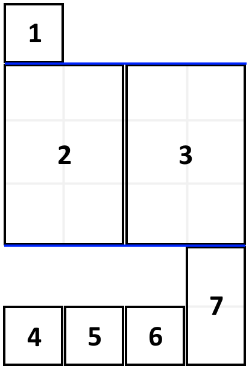

# 2019.09.23-2019.09.29

## Algorithm
1. 题目
```
1105. 填充书架（011）
```
2. 题目描述
```
附近的家居城促销，你买回了一直心仪的可调节书架，打算把自己的书都整理到新的书架上。

你把要摆放的书 books 都整理好，叠成一摞：从上往下，第 i 本书的厚度为 books[i][0]，高度为 books[i][1]。

按顺序 将这些书摆放到总宽度为 shelf_width 的书架上。

先选几本书放在书架上（它们的厚度之和小于等于书架的宽度 shelf_width），然后再建一层书架。重复这个过程，直到把所有的书都放在书架上。

需要注意的是，在上述过程的每个步骤中，摆放书的顺序与你整理好的顺序相同。 例如，如果这里有 5 本书，那么可能的一种摆放情况是：第一和第二本书放在第一层书架上，第三本书放在第二层书架上，第四和第五本书放在最后一层书架上。

每一层所摆放的书的最大高度就是这一层书架的层高，书架整体的高度为各层高之和。

以这种方式布置书架，返回书架整体可能的最小高度。

```
示例：



```
输入：books = [[1,1],[2,3],[2,3],[1,1],[1,1],[1,1],[1,2]], shelf_width = 4
输出：6
解释：
3 层书架的高度和为 1 + 3 + 2 = 6 。
第 2 本书不必放在第一层书架上。
 

提示：

1 <= books.length <= 1000
1 <= books[i][0] <= shelf_width <= 1000
1 <= books[i][1] <= 1000

来源：力扣（LeetCode）
链接：https://leetcode-cn.com/problems/filling-bookcase-shelves

```

3. 解答：

```golang
func minHeightShelves(books [][]int, shelf_width int) int {
	n := len(books)
	dp := make([]int, n+1)
	for i := 0; i<n+1;i++ {
		dp[i] = 1000000
	}
	dp[0] = 0
	for i := 1; i < n+1; i++ {
		tw, j, h := 0, i, 0
		for j > 0 {
			tw = tw + books[j-1][0]
			if tw > shelf_width {
				break
			}
			if h < books[j-1][1] {
				h = books[j-1][1]
			}
			if dp[i] > dp[j-1]+h {
				dp[i] = dp[j-1] + h
			}
			j--
		}
	}
	return dp[n]
}
```
4. 说明
动态规划，用 dp[i] 表示放置前 i 本书所需要的书架最小高度，初始值 dp[0] = 0，其他为最大值 1000*1000。遍历每一本书，把当前这本书作为书架最后一层的最后一本书，将这本书之前的书向后调整，看看是否可以减少之前的书架高度。状态转移方程为 dp[i] = min(dp[i] , dp[j - 1] + h)，其中 j 表示最后一层所能容下书籍的索引，h 表示最后一层最大高度。


## Review
1. 原文链接

[I Don’t Drink. Please Stop Asking.](https://medium.com/@yatesjordann/i-dont-drink-please-stop-asking-fb6d762c6d88)

2. 翻译
`I don’t drink. That’s a complete sentence.`
我不喝酒，是一句完整的话。

`The reasons range from “because I don’t want to” to “mind your own business” and really, the reasons aren’t all that important. What matters is that I don’t drink — not at a party, not at home, not at the Outback Steakhouse where I spent my 21st birthday.`
理由从“因为我不想”到“管好你自己的事”，真的，理由并不是那么重要。重要的是我不喝酒-聚会喝、在家里不喝、在我过21岁生日的澳派克牛排店也不喝。

`Nope. Never. I do not drink alcohol.`
不，从未，我不喝酒。

`Before I turned 21, people just thought I was a bit odd. Usually the conversation went something like:`
在我21岁之前，大家觉得我有点古怪，通常谈话的内容是：

`“Want a glass of wine? I won’t tell your parents!”`
想喝一杯酒吗？我不会告诉你的父母！

`“I don’t drink, but thank you.”`
谢谢你，我不喝酒。

`“Oh, you’re no fun! Relax, live a little. It won’t kill you.”`
哦，你太没趣了！放松一点，喝一点，它不会要你的命的。

`“I’m good, but thank you.”`
我很好，但还是谢谢你的好意。

`“Well, fine. Suit yourself.”`
好吧，好吧，随便你。

`And that was it. I suppose everyone just thought I was an ardent rule-follower (and I am — that’s beside the point). When I turned 21, a lot of people assumed I’d “loosen up” and start drinking.`
就这样，我希望每个人认识到我是一个狂热的规则追随者（我是-这不重要）。当我21岁以后，很多人会以为我会“放松”并且开始饮酒。

`But I didn’t.`
但是，我没有。

`I’ve been 21 for nearly two months and I still don’t know what wine tastes like. I haven’t ordered a fruity drink when I’ve gone out to dinner. I’ve never done a shot of anything.`
当我还有2个月满21岁的时候，我依然没有尝过酒的味道。当我出去吃饭的时候我连水果饮料都不会点。我什么都没做过。

`It’s not like this is a conscious exercise of restraint for me — I really, truly, do not care about drinking. I don’t feel deprived. Drinking just isn’t interesting to me.`
这对我来说不是有意识的克制——我是确实、真实的不喜欢喝酒。我不觉得被剥夺了什么。只是对喝酒不感兴趣。

`Boy, does that bother other people. It’s not people my age so much as it is older people, especially those who view turning 21 as a rite of passage. To them, going out and getting totally hammered is the whole point of turning 21. It’s the celebration of starting a new phase of life — one where you get carded when you order something. And you have to pay taxes. What a time.`
天哪，这会困扰别人吗？与其说是我这个年纪的人，不如说是老年人，尤其是那些把21岁视为成人礼的人。对他们来说，走出去，全身心地投入是21岁的全部转折点。这是一个开始新生活阶段的庆祝活动——当你点东西的时候，你会得到卡片。你还得交税。多么美好的时光啊！

`More than once I’ve had to awkwardly deflect their angst.`
我不止一次不得不尴尬地转移他们的焦虑。

`“You’re finally 21! How’s it been?”`
你终于21岁了，你最近怎么样？

`“I feel old. My hips ache.”`
我觉得自己老了，我的屁股疼。

`“Ha! Classic aging. Been having fun going to all the bars?”`
哈！金典的年龄啊。去酒吧玩的开心吗?

`“I don’t drink, so no, I haven’t.”`
我不喝酒，所以没有，我没有去酒吧。

`“What? WHAT? Oh my god, seriously?”`
什么？什么？天哪，真的吗？

`“Yeah… no. I don’t. Not interested.”`
是的... 没有。我没有去。不感兴趣。

`“That’s crazy! I’ll have to buy you a drink sometime.”`
这太疯狂了！我得找个时间请你喝一杯。

`“That’s okay. I don’t drink.”`
没关系，我不喝酒。

`“How about a bottle of wine?”`
就一瓶酒怎么样？

`“I’ll accept it if you buy it for me, but I’ll pass it on to someone else. I don’t drink.”`
如果你买酒给我，我会接受，但是我会把它送给其他人。我不喝酒。

`“Oh, c’mon, don’t be so boring! You’re only young once!”`
哦，来吧，别这么无聊！你只年轻一次！

`“I don’t drink. Sorry.”`
对不起，我不喝酒。

`And on and on it goes. I get it — a 21-year-old who’s never had alcohol is a novel concept. But the constant insistence that I try just one drink is endlessly frustrating.`
一天天过去。我明白了——一个21岁从未喝过酒的人是一个新奇的概念。但一直坚持我只喝一杯却让人沮丧不已。

`What does it take to get someone to respect my “no”?`
该怎么样才能让别人尊重我不喝酒呢？

`I don’t know how to be any clearer than “I do not drink.” It starts to feel like explaining why I don’t drink might be the only way to get them to stop. But besides having to share more about myself than perhaps I’d like to, the problem with explaining is that I don’t want them to think there’s room for argument.`
我不知道如何比“我不喝酒”更清楚。它开始感觉到解释为什么我不喝酒可能是唯一让他们停下来的方法。但除了要比我想分享的更多关于我自己的信息外，解释的问题是我不想让他们认为有争论的余地。

`If I said “I don’t drink because I’m watching my weight” (not true, just an example), I’d get an earful about calories and benefits and how red wine is actually wonderful for you and —`
如果我说“我不喝酒是因为我在看着我的体重”（不是真的，只是一个例子），我会得到关于卡路里和好处的信息，以及红酒对你和你来说是多么美妙。

`You get the picture.`
你明白了。

`I’m not interested in argument, though. I’m interested in not talking about why I don’t drink or what I should drink or how you’ll buy me a drink sometime. You won’t change my mind, and I’m not interested in letting you try.`
不过，我对争论不感兴趣。我不想谈论为什么我不喝酒，不喝什么，也不想给我买一杯饮料。你不会改变我的主意，我也不想让你试试。

`And I do not owe you an explanation for why I don’t drink, anyway. I don’t owe you an explanation for anything. The fact that I’ve said “I do not drink” is an answer in and of itself.`
我也不欠你解释为什么我不喝酒。我不欠你任何解释。我说“我不喝酒”本身就是一个答案。

`It’s an important lesson for everyone you meet in life. Some people will do things that don’t make sense to you. You’ll see people who seem able-bodied park in handicapped spots. You’ll have friends who won’t go certain places with you and won’t say why. You’ll meet coworkers who have accommodations that you don’t understand.`
这是你在生活中遇到的每一个人的重要一课。有些人会做一些对你毫无意义的事情。你会看到残疾人公园里那些看起来很健壮的人。你的朋友不会和你一起去某些地方，也不会说为什么。你会遇到那些你不理解的同事。

`People do things for lots of reasons. Those reasons could be pretty surface (“I just don’t like how it tastes”) to pretty personal (“I’m a recovering alcoholic”).`
人们做事有很多原因。这些原因可能是相当表面的（“我不喜欢它的味道”）相当个人（“我是一个恢复酒精”）。 

`Whatever those reasons are:
 You don’t have an inherent right to know them.
 Other people have the right to say no and have their wishes respected.
 So please, stop offering me alcohol and stop demanding to know why I won’t have “just one drink.”
 I don’t drink. That’s a complete sentence.`
 
 不管这些原因是什么：
 
 你没有固有的权利去了解他们。
 
 其他人有权拒绝并尊重他们的愿望。
 
 所以拜托，别再给我酒了，别再要求我知道为什么我不喝“一杯”。
 
 我不喝酒。那是一个完整的句子。


3. 点评

这篇文章比较有意思，讲的是自己不喝酒所面对的一些困惑。当在别人劝你酒时，要坚持自己，说我不喝酒，确实也很难。作者是个`rule-follower`对自己要求很高，所以任何场合都不喝酒。这一点值得我们学习，但我还是要喝酒，因为和朋友聚会的时候，喝点酒氛围更好。


## Tip
### 标题


## Share
### 标题
