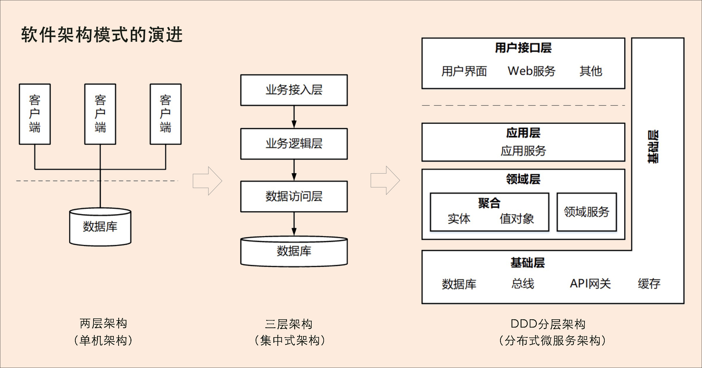

# 2019.11.11-2019.11.17

## Algorithm
### 1. 题目
```
130. 被围绕的区域（017）
```
### 2. 题目描述
```
给定一个二维的矩阵，包含 'X' 和 'O'（字母 O）。

找到所有被 'X' 围绕的区域，并将这些区域里所有的 'O' 用 'X' 填充。

示例:

X X X X
X O O X
X X O X
X O X X
运行你的函数后，矩阵变为：

X X X X
X X X X
X X X X
X O X X
解释:

被围绕的区间不会存在于边界上，换句话说，任何边界上的 'O' 都不会被填充为 'X'。 任何不在边界上，或不与边界上的 'O' 相连的 'O' 最终都会被填充为 'X'。如果两个元素在水平或垂直方向相邻，则称它们是“相连”的。
```

### 3. 解答：
```golang
var BD [][]byte

func solve(board [][]byte) {
	BD = board
	r := len(board)
	if r == 0 {
		return
	}
	c := len(board[0])
	if r < 3 || c < 3 {
		return
	}

	for i := 0; i < r; i++ {
		dfs(i, 0)
		dfs(i, c-1)
	}

	for i := 0; i < c; i++ {
		dfs(0, i)
		dfs(r-1, i)
	}

	for ri, row := range board {
		for ci, _ := range row {
			if board[ri][ci] == 'O' {
				board[ri][ci] = 'X'
			}
			if board[ri][ci] == '#' {
				board[ri][ci] = 'O'
			}
		}
	}
}

func dfs(i, j int) {
	r, c := len(BD), len(BD[0])
	if i < 0 || j < 0 || i >= r || j >= c || BD[i][j] != 'O' {
		return
	}
	BD[i][j] = '#'
	dfs(i-1, j)
	dfs(i+1, j)
	dfs(i, j-1)
	dfs(i, j+1)
}
```
### 4. 说明
```text
最开始的思路是通过动态规划去做，但始终通过不了，后来通过看其他网友的解答，是通过对四个方向进行递归可以解决。
```

## Review
### 1. 原文链接
[What is Ethereum?](https://ethereum.org/beginners/)

### 2. 翻译
```text
What is Ethereum?
```
```text
什么是以太坊？
```

```text
New to Ethereum? You’re in the right place. Let’s start with the big picture.
```
```text
以太坊新手？你来对地方了。让我们从大局出发。
```

```text
Ethereum is the foundation for a new era of the internet:
```
```text
以太坊是互联网新时代的基础设施：
```

```text
An internet where money and payments are built in.
An internet where users can own their data, and your apps don’t spy and steal from you.
An internet where everyone has access to an open financial system.
An internet built on neutral, open-access infrastructure, controlled by no company or person.
```
```text
一种内置资金和交易的互联网。
一种用户可以拥有他们的数据的互联网，你的各种应用不会盗取你的数据。
一种每个人都有机会进入一个开放的金融体系的互联网。
一种建立在中立、开放存取基础设施上的互联网，不受任何公司或个人的控制。
```

```text
Launched in 2015, Ethereum is the world’s leading programmable blockchain.
```
```text
以太坊于2015年推出，是全球领先的可编程区块链。
```

```text
Like other blockchains, Ethereum has a native cryptocurrency called Ether (ETH). ETH is digital money. If you’ve heard of Bitcoin, ETH has many of the same features. It is purely digital, and can be sent to anyone anywhere in the world instantly. The supply of ETH isn’t controlled by any government or company - it is decentralized, and it is scarce. People all over the world use ETH to make payments, as a store of value, or as collateral.
```
```text
与其他区块链一样，以太坊拥有一种称为以太（ETH）的原生加密货币。ETH是数字货币。如果你听说过比特币，ETH有很多相同的功能。它是纯数字的，可以立即发送给世界上任何地方的任何人。ETH的供应不受任何政府或公司的控制，它是分散的，而且是稀缺的。全世界的人都用ETH来支付，作为价值的储存，或者作为抵押品。
```

```text
But unlike other blockchains, Ethereum can do much more. Ethereum is programmable, which means that developers can use it to build new kinds of applications.
```
```text
但与其他区块链不同，以太坊可以做得更多。以太坊是可编程的，这意味着开发人员可以使用它来构建新的应用程序。
```

```text
These decentralized applications (or “dapps”) gain the benefits of cryptocurrency and blockchain technology. They can be trustworthy, meaning that once they are “uploaded” to Ethereum, they will always run as programmed. They can control digital assets in order to create new kinds of financial applications. They can be decentralized, meaning that no single entity or person controls them.
```
```text
这些分散的应用程序（或“dapp”）获得了加密货币和区块链技术的好处。它们可以是可信的，这意味着一旦它们被“上传”到以太坊，它们将始终按程序运行。他们可以控制数字资产，以创造新的金融应用类型。它们可以分散，也就是说没有一个实体或个人控制它们。
```

```text
Right now, thousands of developers all over the world are building applications on Ethereum, and inventing new kinds of applications, many of which you can use today:
```
```text
现在，全世界成千上万的开发人员正在以太坊上构建应用程序，并发明了新的应用程序，其中许多应用程序现在可以使用：
```

```text
Cryptocurrency wallets that let you make cheap, instant payments with ETH or other assets
Financial applications that let you borrow, lend, or invest your digital assets
Decentralized markets, that let you trade digital assets, or even trade “predictions” about events in the real world
Games where you own in-game assets, and can even make real money
And much, much more.
```
```text
加密货币钱包，让您可以用ETH或其他资产进行廉价的即时支付
允许您借出、借出或投资数字资产的金融应用程序
去中心化的市场，让你交易数字资产，甚至交易对现实世界事件的“预测”
拥有游戏内资产，甚至可以赚大钱的游戏
还有更多。
```

```text
The Ethereum community is the largest and most active blockchain community in the world. It includes core protocol developers, cryptoeconomic researchers, cypherpunks, mining organizations, ETH holders, app developers, ordinary users, anarchists, fortune 500 companies, and, as of now, you.
```
```text
以太坊社区是世界上最大、最活跃的区块链社区。它包括核心协议开发人员、加密经济研究人员、cypherpunks、矿业组织、ETH持有者、应用程序开发人员、普通用户、无政府主义者、财富500强公司，以及截至目前为止的你。
```

```text
There is no company or centralized organization that controls Ethereum. Ethereum is maintained and improved over time by a diverse global community of contributors who work on everything from the core protocol to consumer applications. This website, just like the rest of Ethereum, was built - and continues to be built - by a collection of people working together.
```
```text
没有公司或中心化组织控制以太坊。以太坊由一个多元化的全球社区贡献者进行维护和改进，他们致力于从核心协议和客户应用的所有方面。这个网站，就像以太坊其他网站一样，由一群人共同建立起来的，而且还在继续建立。
```

```text
Welcome to Ethereum.
```
```text
欢迎来到以太坊。
```


### 3. 点评
```text
这是一篇以太坊官网的文章，是关于以太坊的简要介绍
```

- 核心单词
`maintained` 保持
`diverse` 多种多样的，多元化的
`era` 时代
`purely` 纯粹的，完全的

## Tip
### 微服务设计为什么要选择DDD?
软件架构模式大体来说经历了从单机、集中式到分布式微服务架构三个阶段的演进。随着分布式技术的快速兴起，我们已经进入到了微服务架构时代。

```text
微服务设计和拆分的困境：
不知道业务或者微服务的边界在什么地方。
```
```text
DDD核心思想是通过是通过领域设计驱动确定领域模型，从而确定业务和领域边界，保证业务模型和代码模型一致。
```
```text
DDD包括战略设计和战术设计两部分：
战略设计主要从业务视角出发，建立业务模型，划分领域边界，建立通用语言的限界上下文，限界上下文，限界上下文可以作为微服务设计的参考边界。
战术设计则从技术视角出发，侧重于领域模型的技术实现，完成开发落地，包括：聚合根、实体、值对象、领域服务、应用服务、资源库等代码逻辑的设计与实现。
```

```text
可以通过三步来划定领域模型和微服务的边界：
第一步：在事件风暴中梳理业务过程中的用户操作、事件以及外部依赖关系等，根据这些要素梳理出领域实体等领域对象。
第二步：根据领域实体之间的业务关联，将业务紧密相关的实体进行组合形成聚合，同时确定聚合中的聚合根、值对象和实体。在这个图里，聚合之间的边界是第一层边界，他们在同一个微服务实例中运行，这个边界是逻辑边界，边界之间用实线来表示。
第三步：根据业务及语义边界等因素，将一个或者多个聚合划定在一个限界上下文内，形成领域模型。在这个图里，限界上下文之间的边界是第二层边界，这一层边界就是未来微服务的边界，不同限界上下文内的领域逻辑被隔离在不同的微服务实例中运行，物理上相互隔离，所以是物理边界，边界之间用实线来表示。
```
```text
有了这两层边界，微服务的设计就不是什么难事了。
```


## Share
### 标题