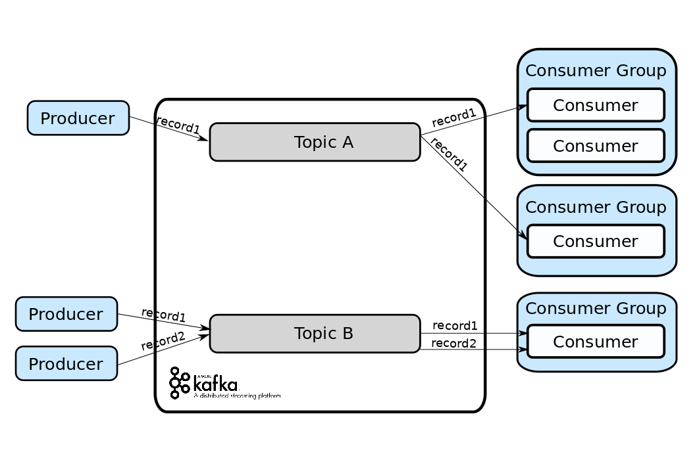
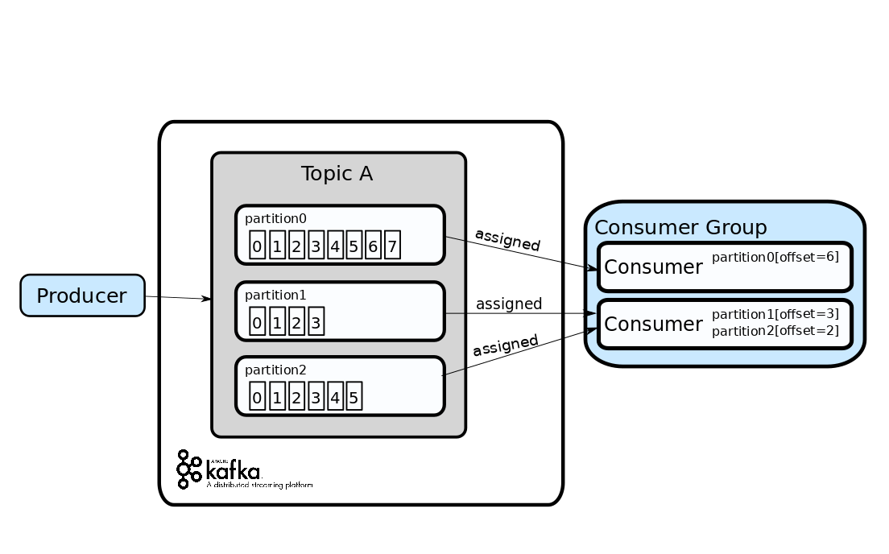

# 2019.12.23-2019.12.29

## Algorithm
### 1. 题目
```
889. 根据前序和后序遍历构造二叉树（023）
```
### 2. 题目描述
```
返回与给定的前序和后序遍历匹配的任何二叉树。

 pre 和 post 遍历中的值是不同的正整数。

 

示例：

输入：pre = [1,2,4,5,3,6,7], post = [4,5,2,6,7,3,1]
输出：[1,2,3,4,5,6,7]
 

提示：

1 <= pre.length == post.length <= 30
pre[] 和 post[] 都是 1, 2, ..., pre.length 的排列
每个输入保证至少有一个答案。如果有多个答案，可以返回其中一个。
```

### 3. 解答：
```golang

func constructFromPrePost(pre []int, post []int) *TreeNode {
	if len(pre) == 0 {
		return nil
	}
	root := &TreeNode{
		Val:   pre[0],
	}
	if len(pre) == 1 {
		return root
	}
	l := 0
	for i, v := range post {
		if v == pre[1] {
			l = i + 1
			break
		}
	}
	left := constructFromPrePost(pre[1:l+1], post[0:l])
	right := constructFromPrePost(pre[l+1:], post[l:len(post)-1])
	root.Left = left
	root.Right = right
	return root
}
```
### 4. 说明

我们令左分支有 L 个节点。我们知道左分支的头节点为 pre[1]，但它也出现在左分支的后序表示的最后。

所以 pre[1] = post[L-1]（因为结点的值具有唯一性），因此 L = post.indexOf(pre[1]) + 1。

现在在我们的递归步骤中，左分支由 pre[1 : L+1] 和 post[0 : L] 重新分支，而右分支将由 pre[L+1 : N] 和 post[L : N-1] 重新分支。

## Review
### 1. 原文链接
[Kafka: All you need to know](https://medium.com/hacking-talent/kafka-all-you-need-to-know-8c7251b49ad0)

### 2. 翻译

Kafka: All you need to know

Kafka: 你需要知道的事

Apache Kafka’s popularity is exploding. Learn about what it is, and why it’s becoming a solution of big data and microservices applications

Apache Kafka的人气正在爆炸。学习它是什么，以及为何它正变成大数据和微服务应用的一种解决方案。

What is Kafka

什么是kafka

Kafka is a Publish/Subscribe messaging system. It allows producers to write records into Kafka that can be read by one or more consumers. 

kafka 是一种发布/订阅消息系统。它允许发布者写记录到kafka,可以被一个或者多个消费者读取。

These records that cannot be deleted or modify once they are sent to Kafka (this is known as “distributed commit log”).

这些记录一旦被发送到Kafka就不会被删除或修改（这被称为“分布式提交日志”）。

Records are published into topics. Topics are like channels where all the records are stored. 

记录被推送到主题。主题类似于存储数据的通道。

Consumers subscribe to one or more topics to read its records. 

消费者订阅一个或多个主题读取他们的消息。

Kafka has a retention period, so it will store your records for the time or size you specify and can be set by topic.

kafka 有保留期，因此它将根据你定义的时间或者大小存储你得记录，并且可以根据主题设置。

Consumers label themselves with a consumer group name. In a consumer group, one or more consumers work together to consume a topic.

消费者们通过一个消费者组名标记他们自己。在一个消费者组内，一个或者多个消费者一起消费一个主题。

When a new record arrives to the topic, it will be sent just to one consumer instance in the consumer group.

当一个新的记录到达这个主题，它将被仅被发送到这个消费者组中的一个消费者实例。



Architecture

架构

Kafka is distributed as in the sense that it stores, receives and sends records on different nodes (called brokers). 

kafka是分布式的因为从某种意义上说它存储、接收、发送记录是在不同的节点上（被称为代理）。

This makes it easy to scale it horizontally and makes it fault-tolerant. 

这使得它易于水平扩展并且使得它具有容错性。
 
Brokers receive records from producers, assigns offsets to them, and commits them to storage on disk.

代理们从生产者接收记录，分配偏移量给它们，并且提交他们存储到磁盘。

To run Kafka, you need Zookeeper. Zookeeper is used for:

为了运行kafka，你需要Zookeeper。Zookeeper被用于：

- Controller election. 

- 控制选举

The controller is one of the brokers and is responsible for maintaining the leader/follower relationship for all the partitions.

控制器是代理之一，负责维护所有分区的领导者/追随者关系。

When a node shuts down, it is the controller that tells other replicas to become partition leaders to replace the partition leaders on the node that is going away.

当一个节点关闭时，是控制器告诉其他副本成为分区领导者，以替换即将消失的节点上的分区领导者。

Zookeeper is used to elect a controller, make sure there is only one and elect a new one it if it crashes.

zookeeper 被用于选举控制器，保证只有一个控制器并且如果控制器崩溃了选举一个新的。

- Cluster membership

- 集群关系

Zookeeper maintains a list of all the brokers that are functioning and are a part of the cluster at any given moment.

Zookeeper维护一个列表，其中列出了在任何给定时刻都在运行并且是集群一部分的所有代理。

- Topic configuration

- 主题配置

which topics exist, how many partitions each has, where are the replicas, who is the preferred leader, what configuration overrides are set for each topic

哪些主题存在，每个分区有多少个分区，副本在哪里，谁是首选的领导者，每个主题都设置了哪些配置重写

- Quotas

- 配额

How much data is each client allowed to read and write

每个客户端允许读取和写入多少数量

- Access Control Lists (ACL) 

- 访问控制列表（ACL）

Who is allowed to read and write to which topic (old high level consumer) — Which consumer groups exist, who are their members and what is the latest offset each group got from each partition.

谁可以读取和写入哪个主题（老的高层次消费者）-哪些消费群体存在，谁是他们的成员，什么是最新的偏移每个组从每个分区得到。

Deep Dive

深潜

As topics can get quite big, they get split into partitions (this improves performance and scalability). 

由于主题可以变得非常大，他们被分成几个分区（这提高了性能和可扩展性）。

So a record will be published in a single partition of a topic. Producers can choose the partition in which a record will be sent to, otherwise, the partition is chosen by Kafka.

因此，一个记录被推送到单个主题的分区。生产者可以选择将记录发送到的分区，否则由kafka选择。

A partition is owned by a single broker in the cluster, and that broker is called the leader of the partition.

分区由集群中的单个代理拥有，这个代理被称为分区的领导者。

A partition may be assigned to multiple brokers, which will result in the partition being replicated. 

一个分区可以分配给多个代理，这将导致分区被复制。

This provides redundancy of records in the partition, such that another broker can take over leadership if there is a broker failure.

在分区中这给记录提供了冗余，如此以满足，如果一个代理失败另一个代理可以接管领导权。

About consumer groups, In order to avoid two consumer instances within the same consumer groups reading the same record twice, each partition is tied to only one consumer process per consumer group.

关于消费者组，为了避免在相同的消费者组下的两个消费者实例读取相同的记录两次，每个分区仅绑定到每个消费者组的一个消费者进程。


Kafka follows the principle of a dumb broker and smart consumer. This means that Kafka does not keep track of what records are read by the consumer.

kafka 遵循愚蠢的代理和聪明的消费者原则。这意味着kafka不用保持跟踪什么记录被消费者读取了。

By storing the offset of the last consumed record for each partition, either in Zookeeper or in Kafka itself, a consumer can stop and restart without losing its place.

通过存储每个分区最后消费记录的偏移量，不是在Zookeeper就是在kafka自身，一个消费者可以在不失去位置的情况下停止和重启。

Each record consists of a key, a value, and a timestamp. This key is assigned by Kafka when producers publish a record. 

每个记录包含一个键，一个值，和一个时间戳。当生产者推送一个记录的时候，这个键是由kafka分配的。

Keys are used when records are to be written to partitions in a more controlled manner.

当记录以一种更受控制的方式写入分区时，使用键。

The simplest such scheme is to generate a consistent hash of the key, and then select the partition number for that record by taking the result of the hash modulo, the total number of partitions in the topic. 

最简单方案是生成一个键的一致性hash，然后通过获取哈希模的结果（主题中的分区总数）来选择该记录的分区号。

This assures that records with the same key are always written to the same partition.

这确保了拥有相同键的记录总是被写入到相同的分区。



Note: While records are opaque byte arrays to Kafka itself, it is recommended that additional structure, or schema, be imposed on the record content so that it can be easily understood.

注意：如果对kafka来说记录是不透明byte数组，则建议对记录内容附加结构，或方案，以便于理解。

Typically, this schema can be JSON or Avro. It is also normal to add some versioning for when it changes.

典型的，这个方案可以是JSON或者Avro。

### 3. 点评

这是一篇介绍kafka的文章，它是一个发布/订阅模式的消息中间件，具有可扩展、高可用等特性，kafka已经是广泛应用于微服务和大数据中的一种解决方案。

## Tip
### 分布式架构关键设计10问

#### 一、选择什么样的分布式数据库？

1. 一体化分布式数据库方案

它支持数据多副本、高可用。多采用 Paxos 协议，一次写入多数据副本，多数副本写入成功即算成功。代表产品是 OceanBase 和高斯数据库。

2. 集中式数据库 + 数据库中间件方案

它是集中式数据库与数据库中间件结合的方案，通过数据库中间件实现数据路由和全局数据管理。数据库中间件和数据库独立部署，采用数据库自身的同步机制实现主副本数据的一致性。集中式数据库主要有 MySQL 和 PostgreSQL 数据库，基于这两种数据库衍生出了很多的解决方案，比如开源数据库中间件 MyCat+MySQL 方案，TBase（基于 PostgreSQL，但做了比较大的封装和改动）等方案。

3. 集中式数据库 + 分库类库方案

它是一种轻量级的数据库中间件方案，分库类库实际上是一个基础 JAR 包，与应用软件部署在一起，实现数据路由和数据归集。它适合比较简单的读写交易场景，在强一致性和聚合分析查询方面相对较弱。典型分库基础组件有 ShardingSphere。

#### 二、如何设计数据库分库主键？

与客户接触的关键业务，我建议你以客户 ID 作为分库主键。这样可以确保同一个客户的数据分布在同一个数据单元内，避免出现跨数据单元的频繁数据访问。跨数据中心的频繁服务调用或跨数据单元的查询，会对系统性能造成致命的影响。将客户的所有数据放在同一个数据单元，对客户来说也更容易提供客户一致性服务。而对企业来说，“以客户为中心”的业务能力，首先就要做到数据上的“以客户为中心”。当然，你也可以根据业务需要用其它的业务属性作为分库主键，比如机构、用户等。

#### 三、数据库的数据同步和复制

传统的数据传输方式有 ETL 工具和定时提数程序，但数据在时效性方面存在短板。分布式架构一般采用基于数据库逻辑日志增量数据捕获（CDC）技术，它可以实现准实时的数据复制和传输，实现数据处理与应用逻辑解耦，使用起来更加简单便捷。现在主流的 PostgreSQL 和 MySQL 数据库外围，有很多数据库日志捕获技术组件。CDC 也可以用在领域事件驱动设计中，作为领域事件增量数据的获取技术。

#### 四、跨库关联查询如何处理？

关联查询的业务场景包括两类：第一类是基于某一维度或某一主题域的数据查询，比如基于客户全业务视图的数据查询，这种查询会跨多个业务线的微服务；第二类是表与表之间的关联查询，比如机构表与业务表的联表查询，但机构表和业务表分散在不同的微服务。

对于第一类场景，由于数据分散在不同微服务里，我们无法跨多个微服务来统计这些数据。你可以建立面向主题的分布式数据库，它的数据来源于不同业务的微服务。采用数据库日志捕获技术，从各业务端微服务将数据准实时汇集到主题数据库。在数据汇集时，提前做好数据关联（如将多表数据合并为一个宽表）或者建立数据模型。面向主题数据库建设查询微服务。这样一次查询你就可以获取客户所有维度的业务数据了。你还可以根据主题或场景设计合适的分库主键，提高查询效率。

对于第二类场景，对于不在同一个数据库的表与表之间的关联查询场景，你可以采用小表广播，在业务库中增加一张冗余的代码副表。当主表数据发生变化时，你可以通过消息发布和订阅的领域事件驱动模式，异步刷新所有副表数据。这样既可以解决表与表的关联查询，还可以提高数据的查询效率。

#### 五、如何处理高频热点数据？

对于高频热点数据，比如商品、机构等代码类数据，它们同时面向多个应用，要有很高的并发响应能力。它们会给数据库带来巨大的访问压力，影响系统的性能。

常见的做法是将这些高频热点数据，从数据库加载到如 Redis 等缓存中，通过缓存提供数据访问服务。这样既可以降低数据库的压力，还可以提高数据的访问性能。

另外，对需要模糊查询的高频数据，你也可以选用 ElasticSearch 等搜索引擎。

缓存就像调味料一样，投入小、见效快，用户体验提升快。

#### 六、前后序业务数据的处理

一般来说，前后序的数据都跟领域事件有关。你可以通过领域事件处理机制，按需将前序数据通过领域事件实体，传输并冗余到当前的微服务数据库中。

你可以将前序数据设计为实体或者值对象，并被当前实体引用。在设计时你需要关注以下内容：如果前序数据在当前微服务只可整体修改，并且不会对它做查询和统计分析，你可以将它设计为值对象；当前序数据是多条，并且需要做查询和统计分析，你可以将它设计为实体。

这样，你可以在货物运输微服务，一次获取前序订单的清单数据和货物运输单数据，将所有数据一次反馈给前端应用，降低跨微服务的调用。如果前序数据被设计为实体，你还可以将前序数据作为查询条件，在本地微服务完成多维度的综合数据查询。只有必要时才从前序微服务，获取前序实体的明细数据。这样，既可以保证数据的完整性，还可以降低微服务的依赖，减少跨微服务调用，提升系统性能。

#### 七、数据中台与企业级数据集成

第一，按照统一数据标准，完成不同微服务和渠道业务数据的汇集和存储，解决数据孤岛和初级数据共享的问题。

第二，建立主题数据模型，按照不同主题和场景对数据进行加工处理，建立面向不同主题的数据视图，比如客户统一视图、代理人视图和渠道视图等。

第三，建立业务需求驱动的数据体系，支持业务和商业模式创新。数据中台不仅限于分析场景，也适用于交易型场景。

你可以建立在数据仓库和数据平台上，将数据平台化之后提供给前台业务使用，为交易场景提供支持。

#### 八、BFF 与企业级业务编排和协同

企业级业务流程往往是多个微服务一起协作完成的，每个单一职责的微服务就像积木块，它们只完成自己特定的功能。那如何组织这些微服务，完成企业级业务编排和协同呢？

你可以在微服务和前端应用之间，增加一层 BFF 微服务（Backend for Frontends）。BFF 主要职责是处理微服务之间的服务组合和编排，微服务内的应用服务也是处理服务的组合和编排，那这二者有什么差异呢？

BFF 位于中台微服务之上，主要职责是微服务之间的服务协调；应用服务主要处理微服务内的服务组合和编排。在设计时我们应尽可能地将可复用的服务能力往下层沉淀，在实现能力复用的同时，还可以避免跨中心的服务调用。

BFF 像齿轮一样，来适配前端应用与微服务之间的步调。它通过 Façade 服务适配不同的前端，通过服务组合和编排，组织和协调微服务。BFF 微服务可根据需求和流程变化，与前端应用版本协同发布，避免中台微服务为适配前端需求的变化，而频繁地修改和发布版本，从而保证微服务核心领域逻辑的稳定。

如果你的 BFF 做得足够强大，它就是一个集成了不同中台微服务能力、面向多渠道应用的业务能力平台。

#### 九、分布式事务还是事件驱动机制？

分布式架构下，原来单体的内部调用，会变成分布式调用。如果一个操作涉及多个微服务的数据修改，就会产生数据一致性的问题。数据一致性有强一致性和最终一致性两种，它们实现方案不一样，实施代价也不一样。

对于实时性要求高的强一致性业务场景，你可以采用分布式事务，但分布式事务有性能代价，在设计时我们需平衡考虑业务拆分、数据一致性、性能和实现的复杂度，尽量避免分布式事务的产生。

领域事件驱动的异步方式是分布式架构常用的设计方法，它可以解决非实时场景的数据最终一致性问题。基于消息中间件的领域事件发布和订阅，可以很好地解耦微服务。通过削峰填谷，可以减轻数据库实时访问压力，提高业务吞吐量和处理能力。你还可以通过事件驱动实现读写分离，提高数据库访问性能。对最终一致性的场景，我建议你采用领域事件驱动的设计方法。

#### 十、多中心多活的设计

分布式架构的高可用主要通过多活设计来实现，多中心多活是一个非常复杂的工程，下面我主要列出以下几个关键的设计。

1. 选择合适的分布式数据库。数据库应该支持多数据中心部署，满足数据多副本以及数据底层复制和同步技术要求，以及数据恢复的时效性要求。

2. 单元化架构设计。将若干个应用组成的业务单元作为部署的基本单位，实现同城和异地多活部署，以及跨中心弹性扩容。各单元业务功能自包含，所有业务流程都可在本单元完成；任意单元的数据在多个数据中心有副本，不会因故障而造成数据丢失；任何单元故障不影响其它同类单元的正常运行。单元化设计时我们要尽量避免跨数据中心和单元的调用。

3. 访问路由。访问路由包括接入层、应用层和数据层的路由，确保前端访问能够按照路由准确到达数据中心和业务单元，准确写入或获取业务数据所在的数据库。

4. 全局配置数据管理。实现各数据中心全局配置数据的统一管理，每个数据中心全局配置数据实时同步，保证数据的一致性。

## Share
### 使用kafka(附golang源码)
[使用kafka(附golang源码)](https://juejin.im/post/5d40f179f265da038f47e9eb)