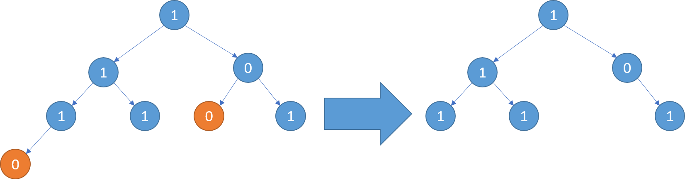

### 1. 题目
```
814. 二叉树剪枝（025）
```
### 2. 题目描述
```
给定二叉树根结点 root ，此外树的每个结点的值要么是 0，要么是 1。

返回移除了所有不包含 1 的子树的原二叉树。

( 节点 X 的子树为 X 本身，以及所有 X 的后代。)
```
```
示例1:
输入: [1,null,0,0,1]
输出: [1,null,0,null,1]
 
解释: 
只有红色节点满足条件“所有不包含 1 的子树”。
右图为返回的答案。
```


```text
示例2:
输入: [1,0,1,0,0,0,1]
输出: [1,null,1,null,1]
```


```text
示例3:
输入: [1,1,0,1,1,0,1,0]
输出: [1,1,0,1,1,null,1]
```
